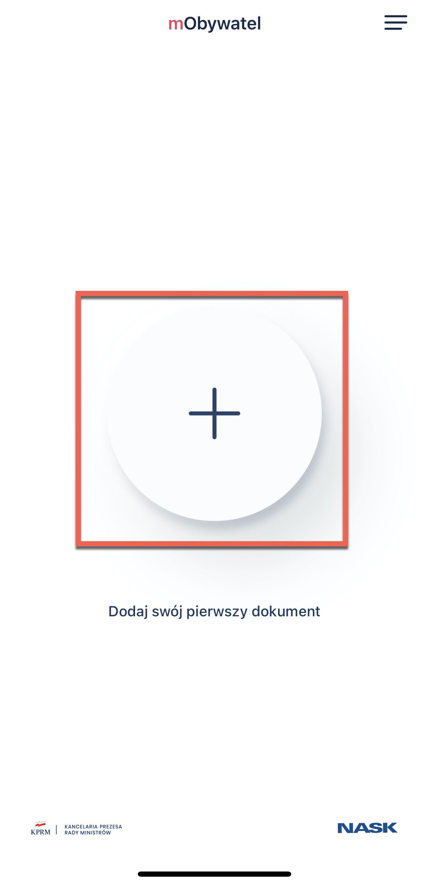
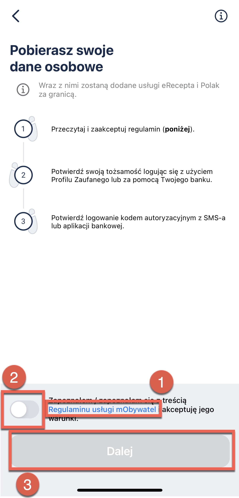
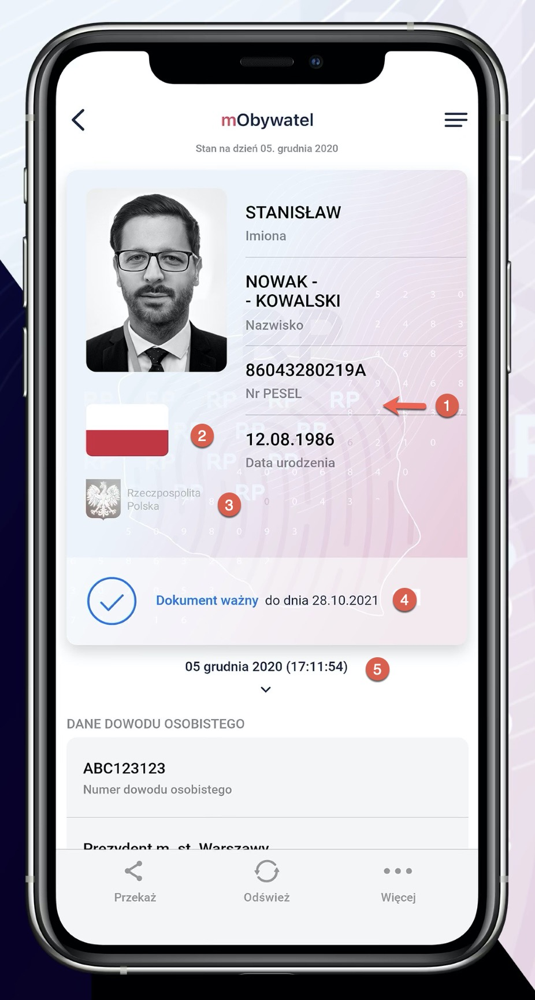

 
 mObywatel
 ====

Thanks to mObywatel, you can to present and confirm your personal data in a simple way.

 You can use this document:
 - in trains
 - during inspections
 - during elections
 - when signing up for loyalty cards
 - when collecting registered mail at a post office
 - at the gym
 - in a store
 - at a reception desk
 - in a clinic
 - in a hotel   

mObywatel uses current identity data from state registers. These are names, surnames, dates of birth, PESEL number, photo, expiration date, ID number, information on who issued the document.

The data stored on the smartphone is encrypted and signed with a certificate. The certificate also confirms the authenticity of the data. You get it when you activate the application - it is assigned only to you and only to your phone.

Even if your phone is lost your data is safe - it is protected not only by encrypted data, but also by phone lock and password, which you choose when activating the application.

**Please note:**   

You **cannot** use mObywatel in a situation    where the law requires you to show your ID card or passport (in a bank, at the airport, at a notary's, registering a SIM card, for example).  

You **cannot** use mObywatel if your ID card is not valid - it has been blocked due to theft or lost, for example.   
   

# How to add documents to mObywatel?

Watch the video and follow the instructions below:

To activate mObywatel, you need a arusted profile - it is needed for your application and other e-government services.

1. Open mObywatel application. 
2. On the home page, click **Add Your First Document**.
    

3. Select **mObywatel** from the list of documents.
    

4. An information about processing your personal data appears:
   - read (1) and accept (2) regulations
   - click **Next**(3)

     

5. Now, you must choose a login method to confirm your personal data. Select the trusted profile if you have:
- trusted profile, 
- bank trusted profile (scroll down and choose **Log in through the bank**),
- a temporary trusted profile.
If you use myID - choose one of the banks available on the list.   

     

    If you do not have a trusted profile, click [**here**](https://www.gov.pl/web/gov/zaloz-profil-zaufany) and follow the instructions.

6. Log in to the system.
7. The data were collected. The document has been added to the application.

How to verify the data?

 

1. **Background graphics** - with patterns showing wavy numerals, RP letters, graphics reminiscent of the geographical outline of Polish borders
   
2. Waving white-and-red **flag**

3. **Hologram** - the emblem of Poland, which changes colors when you tilt the phone.

4. **Document status** - valid, expired.

5. Real-time **date and time**