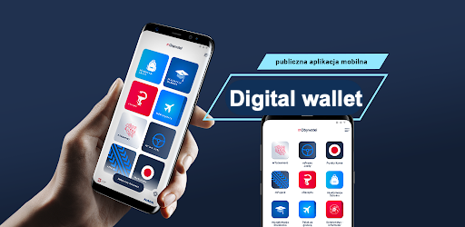

# Adding documents to mObywatel

This section provides information how to add ID, driver's licence, and vehicle information to this application.

To add documents to this application, you are required to log in with your trusted profile. If you do not have trusted profile, go to [**Trusted profile**](trustedprofile.md) section.

