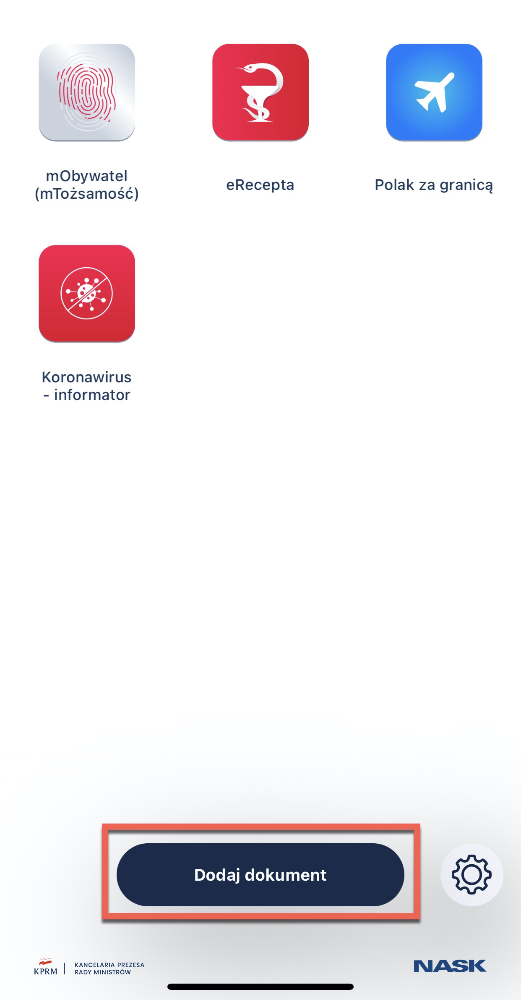
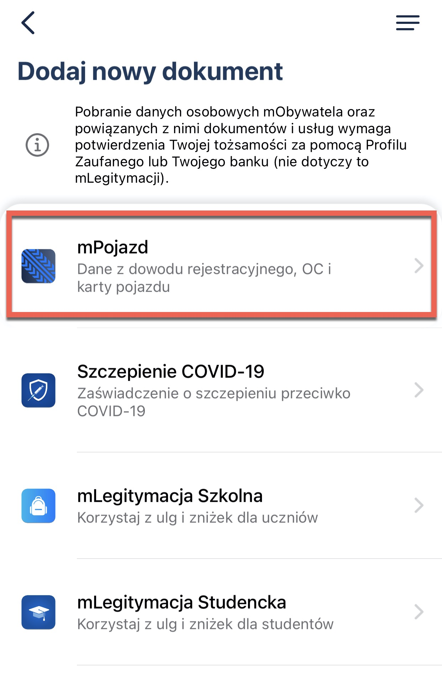
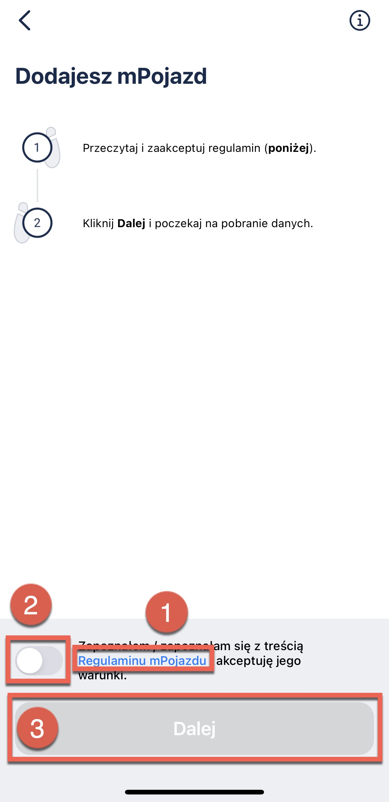
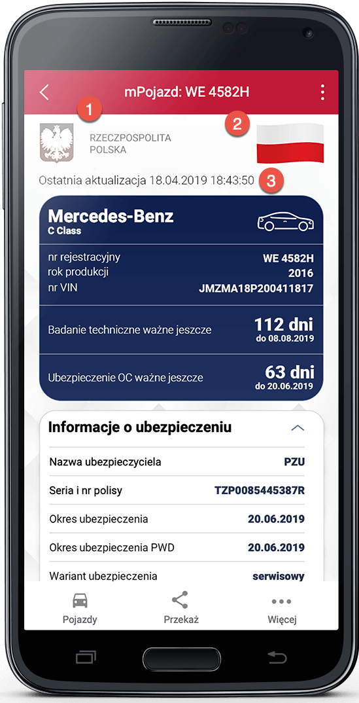

mPojazd
===

The data from mPojazd reflect the data included in the registration certificate, civil liability policy, and vehicle card.

The service can be used by persons who are owners or co-owners of vehicles. So, those who are registered in the Central Register of Vehicles as owners of cars, motorcycles, scooters, and such. In other words, in order to use mPojazd, you have to be entered into the registration card. This means that you will not see rented, company, or leased cars in the application.

Here, you can find vehicle data like make and model, year of manufacture, registration number, VIN number, date of technical inspection, odometer reading (entered by a diagnostic station or the police). The service also allows you to transfer the vehicle data in the form of QR code to other applications.

The service shows information about the vehicle's obligatory third-party insurance, including insurance name, series and number of the policy, insurance period, and its variant. Additionally, before the third-party insurance expires, the application shows a reminder.

# How to add information about your vehicle to mObywatel?

Watch the video and follow the instructions written below:

1. Open **mObywatel** application. 
2. Click **Add document** on the home page.

    

3. Select **mPojazd** from the list.
   
    

4. An information about processing your personal data appears:
   - read (1) and accept (2) **terms and conditions**
   - click **Next** (3)

    

5. The data is now collected. The document has been added to the application.

## How to verify the data?

The entire document has a watermark in the background and a uniform background graphic.

1. **Hologram** - graphic element with various colors depending on the angle of inclination of the smartphone, in a shape corresponding to the National Emblem of the Republic of Poland.
2. **Dynamic element** - a moving graphic element displaying the red and white flag.
3. **Last update date** - the date the data was downloaded or refreshed.
