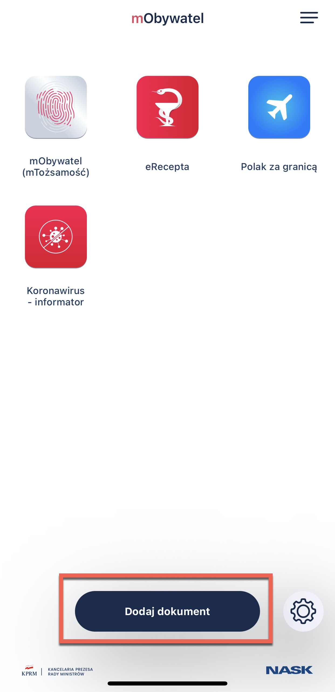
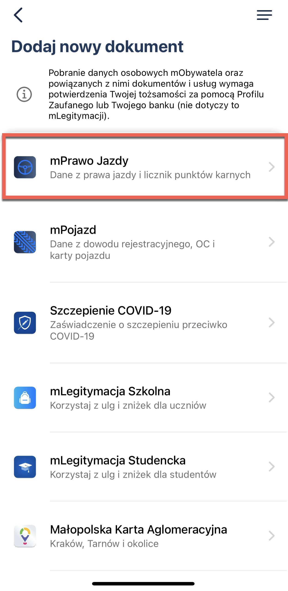
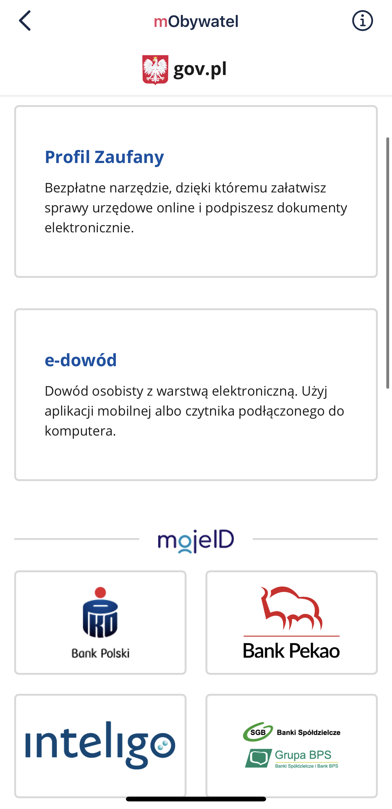
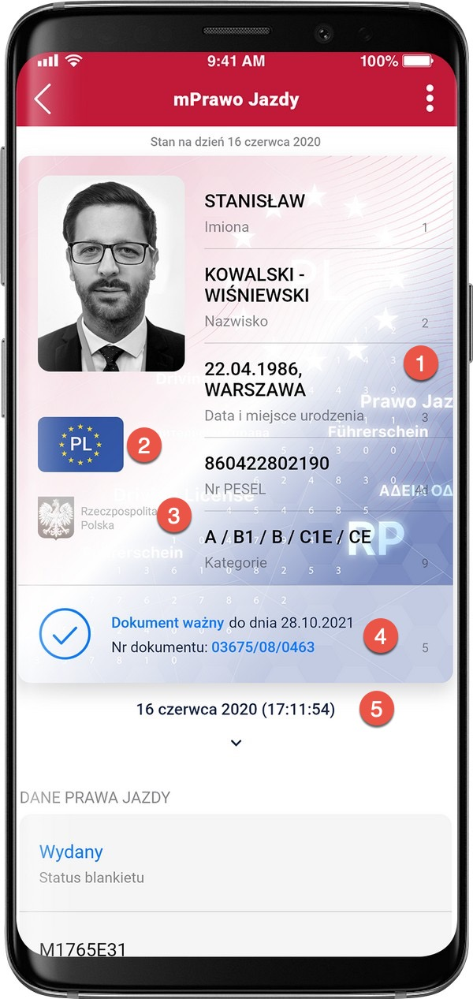

mPrawo Jazdy
===

The mPrawo Jazdy is a digital document with a representation of your driving privileges.

mDriving license uses up-to-date data from state registers. More precisely, from the data contained in the Central Register of Drivers (part of the Central Register of Vehicles and Drivers). 

You can use this document:

- when renting or car
- confirming your driving privileges
- buying car insurance
- during a roadside check (although usually, the police check your information online)
- during a collision - when you show your driving privileges to another driver without calling the police. 

The data stored on the smartphone is encrypted and signed with a certificate. The certificate also confirms the authenticity of the data. You get it when you activate the application - it is assigned only to you and only to your phone.

# How to add the driving license to mObywatel?

Watch the video and follow the instructions written below:

1. Open mObywatel application. 
2. Click **Add document** on the home page.

    

3. Select **mPrawo Jazdy** from the list.
   
    

4. An information about processing your personal data appears:
   - read (1) and accept (2) **terms and conditions**
   - click **Next** (3)

5. Now, you must choose a login method to confirm your personal data. Select the trusted profile if you have:
   - trusted profile, 
   - bank trusted profile (scroll down and choose **Log in through the bank**),
   - a temporary trusted profile.  
    - If you use myID - choose one of the banks available on the list.   

    

6. Log in to the system.
7. The data were collected. The document has been added to the application.

## How to verify the data?

1. **Guilloche** - background graphics elements with variable colors and lettering, dependent on the angle of the mobile device.
2. **Flag** - a movable graphic element, presenting a blue flag with twelve gold stars and the abbreviation "PL".
3. **Hologram** - a graphic element with variable colors, depending on the angle of inclination of the mobile device, in a shape corresponding to the National Emblem of the Republic of Poland.
4. **Document status** - valid, expired.
5. Real-time date **and time**.

If there is a discrepancy in the data, open [this](https://www.gov.pl/web/gov/zglos-rozbieznosc-w-danych-prawa-jazdy) page and report it electronically by filling out the form.