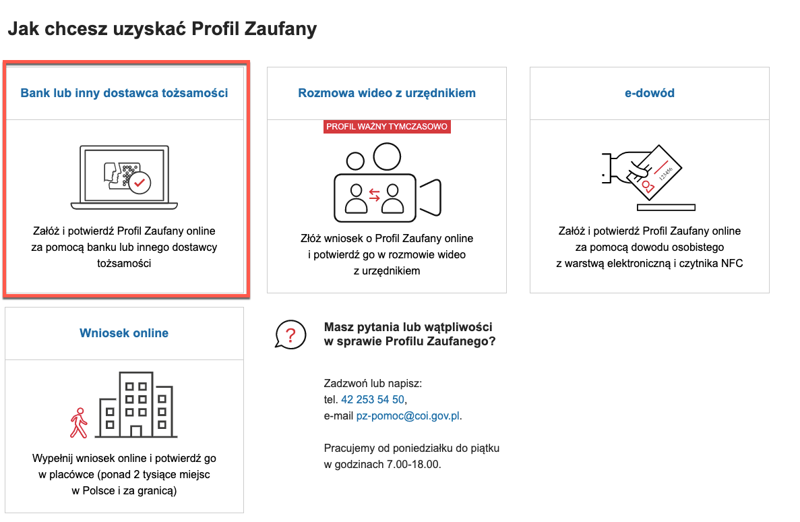
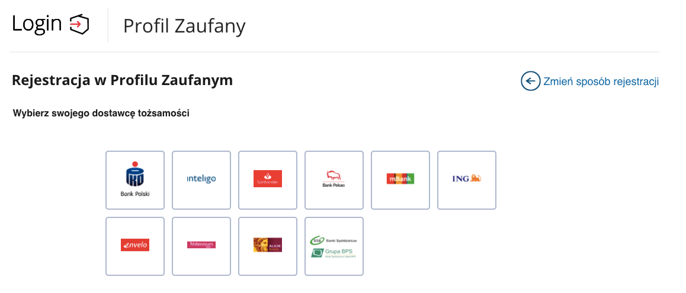
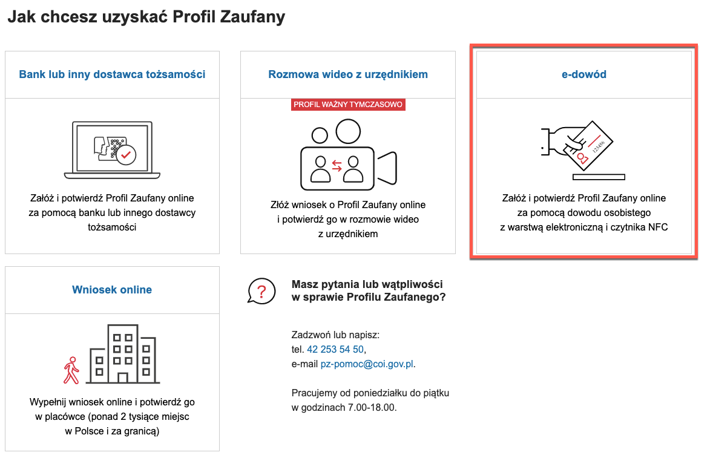
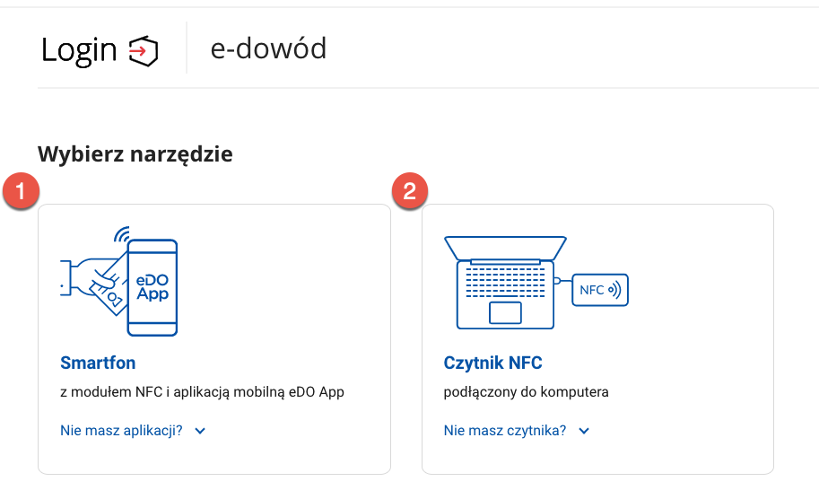
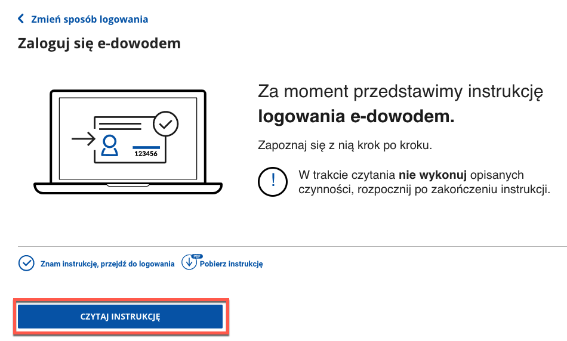
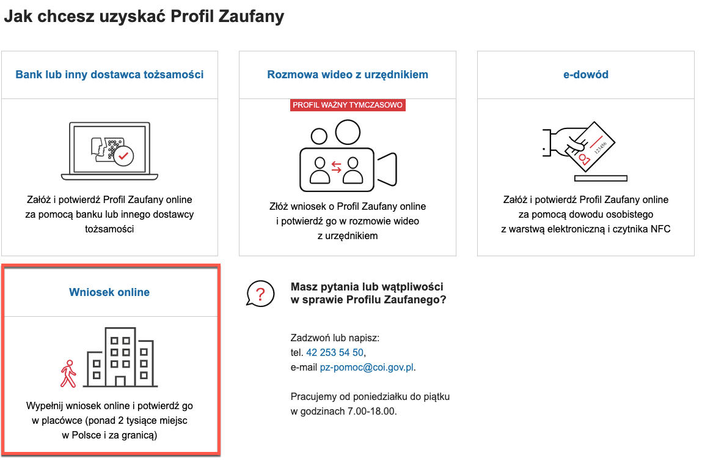
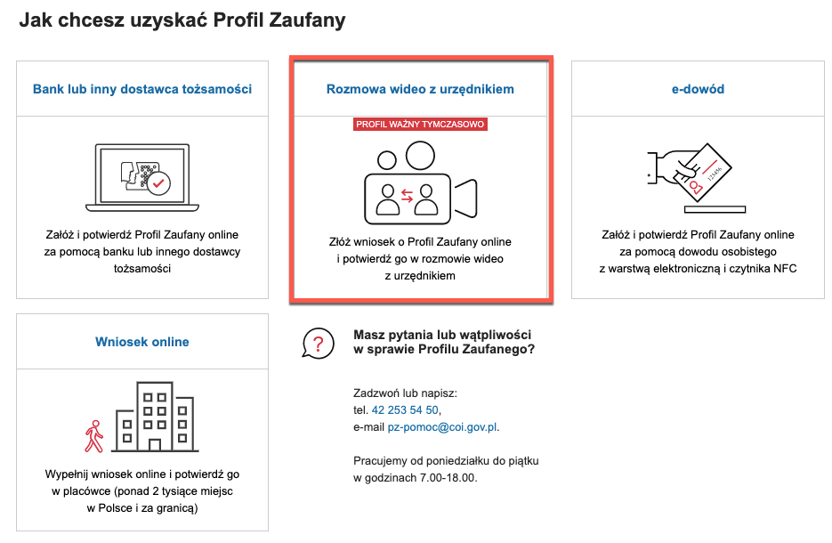
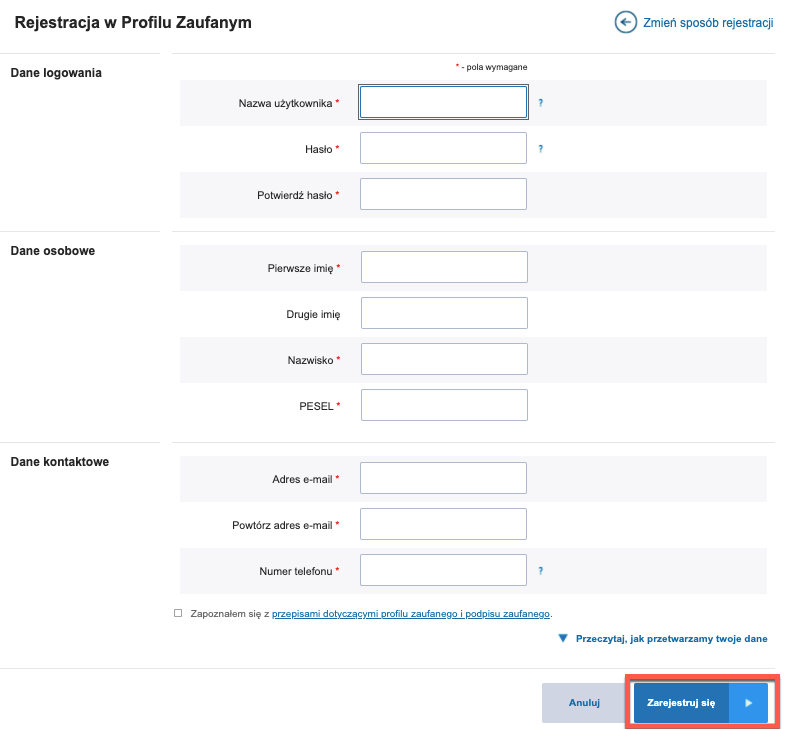

Trusted profile
===

To activate mObywatel, you need a trusted profile - it is needed for this application and other e-government services.

The trusted profile allows you to do official business online. It's a method of confirming the identity of a Polish citizen in electronic administration systems. In this case, it is an alternative to a paid qualified signature. You can use it to log in to such a system and, if necessary, create an electronic signature (trusted signature), which is as effective for public entities as a handwritten signature.

# What can you do with a trusted profile?

- log in to an Internet Patient Account
- apply for an ID 
- check if your ID is ready to be collected
- check your penalty points
- apply for government benefits 
- file tax declarations on the tax portal
- apply for a European Health Insurance Card
- apply for a business registration
- send a letter to a public entity 
- handle many other official matters requiring proof of identity or an electronic signature.

# How to set up a trusted profile?

You can set up a trusted profile in four ways.

## With your bank or other identity providers

The trusted profile can be set up in the following banking services:

- PKO BP
- ING Bank Śląski
- Bank Millennium
- Inteligo
- Bank Pekao
- mBank
- Santander 
- Alior Bank
- and in over 300 cooperative banks and in Envelo - Polish Post service

1. To confirm your trusted profile using your online banking, go to [register home page](https://pz.gov.pl/pz/registerMainPage) and select **Bank or other identity provider**.

    

2. Select your bank from the list.

    

Follow the displayed instructions on your bank's website.

## Using e-dowód

e-dowód is an ID card with an electronic layer. Externally it looks similar to the identity card issued so far. The only new information on the front side of the document is the CAN number. It is also written in a bar code on the other side. You will need this number if you want to use the electronic functions of the e-card. 

1. To confirm your trusted profile using your online banking, go to [register home page](https://pz.gov.pl/pz/registerMainPage) and select **e-dowód**.

    

2. Now, you are asked to choose:

      

    **Smartphone with NFC module** and **eDO App** (1):
    - Open the **eDO App** mobile app.
    - Scan the QR code or write the number displayed under the code.
    - Follow the instructions displayed on the screen.
   

    **NFC reader connected to computer** (2):
    - Click **Read the instructions**.
    - Read and follow the instructions displayed on the screen.
  

## Online application

If you do not have access to electronic banking, you may also set up a trusted profile by selecting **Online application**. 

The profile set up in this way requires personal confirmation of identity. You can do this:
- in one of the selected confirmation points (over two thousand places in Poland and abroad). Go to the [list of confirmation points.](https://pz.gov.pl/pz/confirmationPointAddressesList)
- online by selecting **video chat with an official** . During this video chat, an official will ask you to confirm that the data in the application is correct and up-to-date. They will ask you to show your ID to read its content. If the whole process is successful, your trusted profile will be confirmed by the official. You will receive the confirmation of the of the trusted profile to your e-mail address.

  

A submitted application is valid for 2 weeks, but if you do not have time to confirm it, you can apply again by logging on to [pz.gov.pl](pz.gov.pl) using the user ID and password you specified during registration.

**Please remember:** When filling in the form, carefully enter your data exactly as it is written in your identity document. If even one letter in your name or surname is inconsistent with the entry in the PESEL register the trusted profile will not be able to be confirmed. People with many first names can enter only the first name.

By clicking **Online application**, you are redirected to a page with a registration form.

1. You must provide:   

      1. **your login details**:
     - Username
     - Password
     - Confirm password   

      1. **personal information**:
     - First name 
     - Second name 
     - Surname 
     - PESEL (Polish Resident Identification Number)   
      1. **contact information**:
     - Email address
     - Confirm e-mail address
     - Phone number

2. Read and accept regulations regarding trusted profile and trusted signature - a link will open in new window.

3. Click **Register**.
