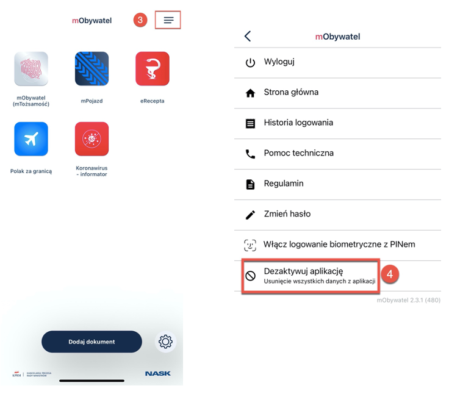
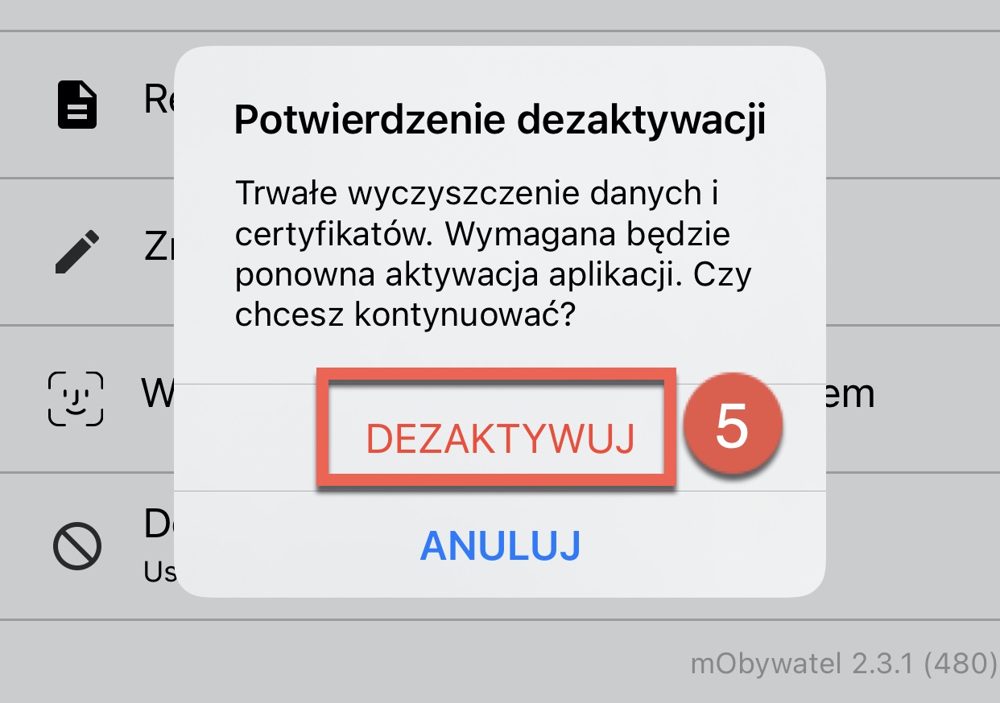
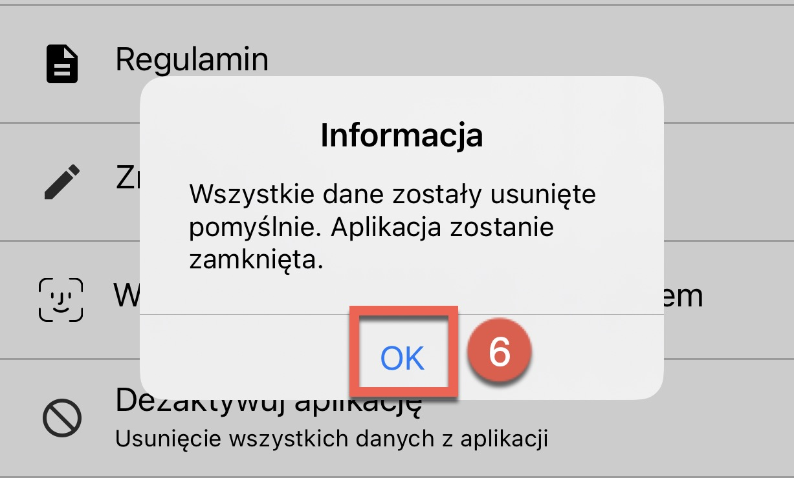

Deactivating the application
===

Deleting the application involves deactivating any added documents. 

# How to delete the application?

Watch the video and follow the instructions below:

1. Open **mObywatel** application. 
2. Provide your credentials and log in.
3. Click **menu** icon at the top right corner of the screen.
4. Click **Deactivate the application**.

    
    
5. The pop-up window with confirming the deactivation information displays. Data and certificate cleaning is in progress. If you wish to continue, click **deactivate**. 

    

6. The pop-up window displays informing the user that 
all the data has been deleted. Click **Ok**.

    

This function deletes data from the application and revokes the certificates.   
If there is no internet connection, only the data from the application is deleted. Then, the user is informed with a pop-up window and can cancel the deactivation. 

