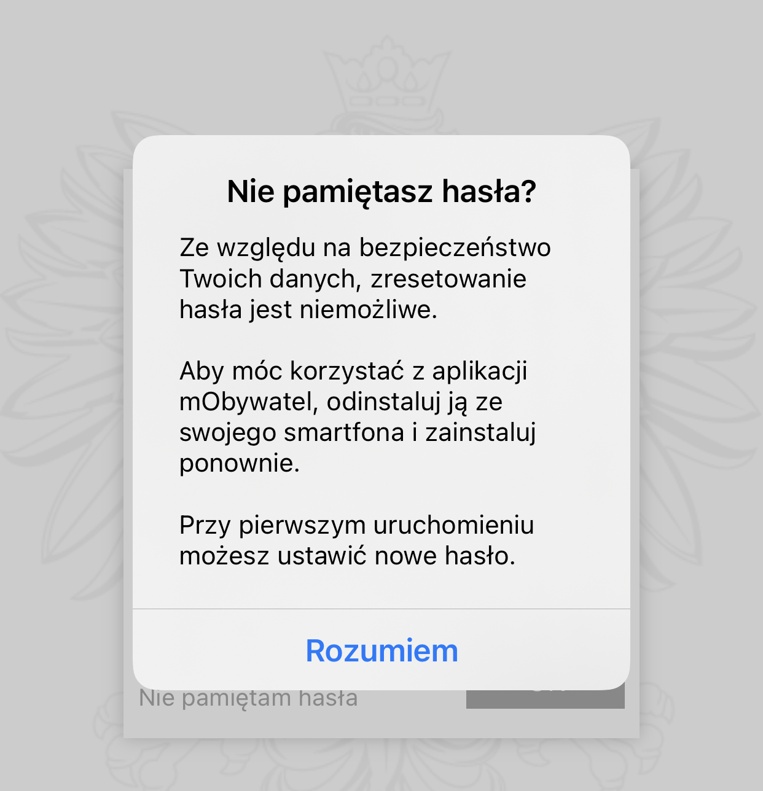

User interface overview
===

Once you have installed the application and have registered the account, find the application on your smartphone and open it.

Now, log in page displays.

Provide the password (1) and click **OK** (2).

If you have forgotten, the password, click **I forgot my password** (3).

Then, the pop-up window is displayed with a warning message:

For data security reasons, password reset is not possible. To use the app, uninstall it from your smartphone and reinstall it. You can set a new password the first time you run the application. For further information, please refer to [Set up a password](registration.md) section.

After logging in to the application, you can see the start page.

Here, you can add your documents. The information on adding documents is described in ............ section.

When you click the **menu** icon in the top right corner, you see functions of the main menu.

1. **Log out** - the user logs out of the application. The pop-up window displays to confirm log out.

2. **Home** - return to the main page of the application. 

3. **Log in history** - view of the user's login history. You can see the date and time the user was logged in.

4. **Technical Support** - contact information for technical support. For more information, please refer to ........ section.
   
    

5. **Regulations** - here you can view the regulations accepted during the application activation process. 
   
    

6. **Change password** -  here you can change the password for the application. 

    Please note: To change your password, you must have at least one active document added.

7. **Enable biometric login with PIN code** - activate or deactivate biometric login with PIN code. 

    Please note: To enable biometric login, you must have at least one active document added.

8. **Deactivate Application** - deletes data from the application and revokes the certificates. If there is no internet connection, only the data from the application is deleted. The user is notified and can cancel the deactivation.
The pop-up window displays to confirm the deactivation.

    