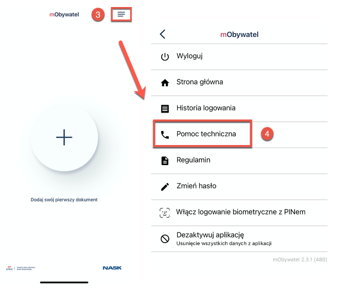
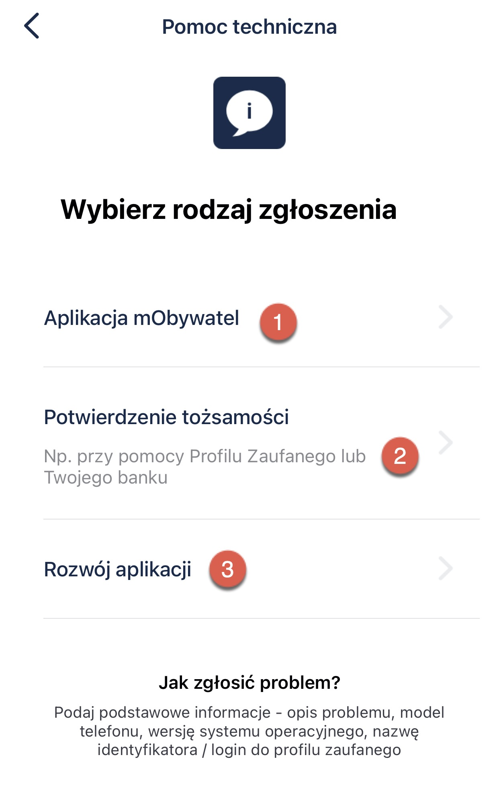
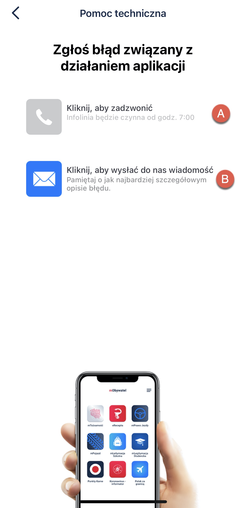
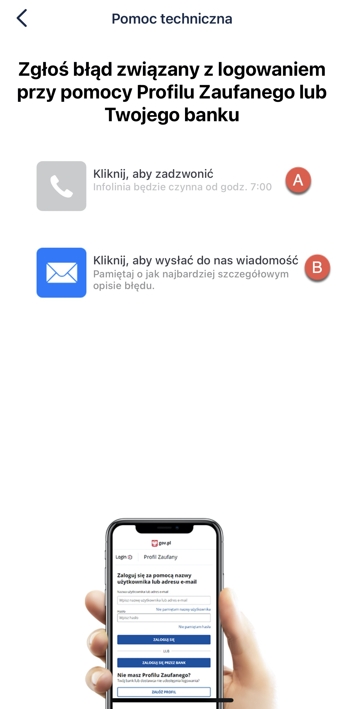
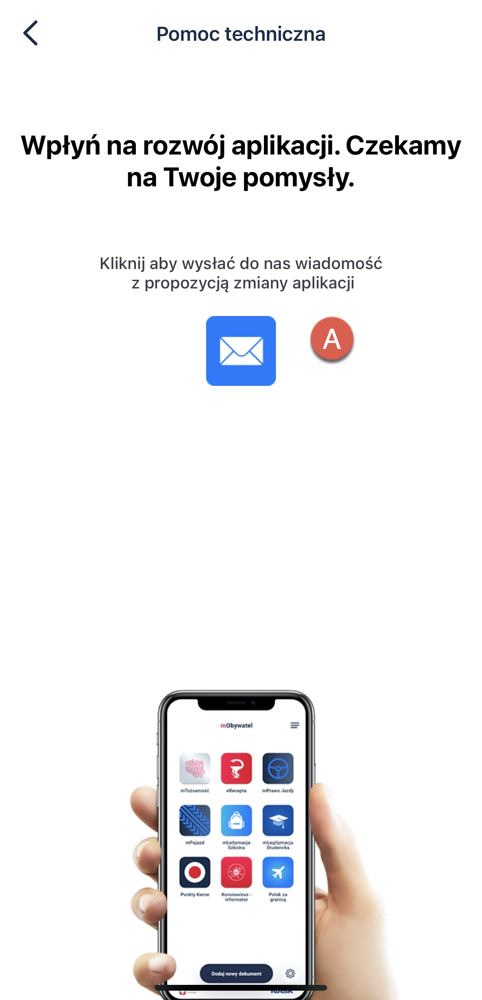

Contact information
===

## Technical Support in mObywatel application

To contact the technical support:

1. Open **mObywatel** application. 
2. Provide your credentials and log in. 
3. Click **menu** icon at the top right corner of the screen. 
4. Click **Technical support**. 

   

5. Now, select the type of request:

    

   1. **mObywatel application** - here, you can report an application error. You can **call the helpline** (A) or **send a message** (B) describing the problem with details.

         

   2. **Identity authentication** - here, you can report an error when logging in with your trusted profile or a bank. You can **call the helpline** (A) or **send a message** (B) describing the problem with details.

      

   3. **Application development** - here, you can submit your idea for the development of the mObywatel application by **sending a message** (A).

      

 

Helpline working hours: Monday through Friday, excluding holidays, from 7:00 a.m. to 6:00 p.m.

## Follow us on social media:

      
