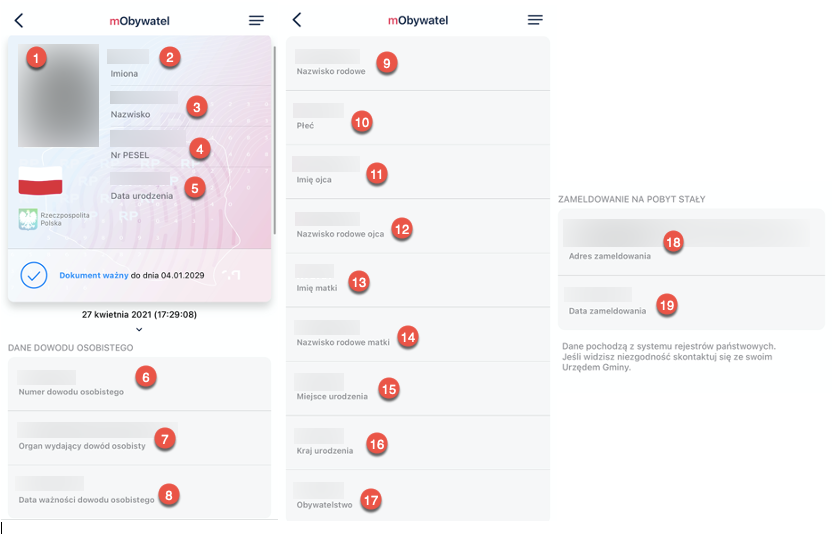
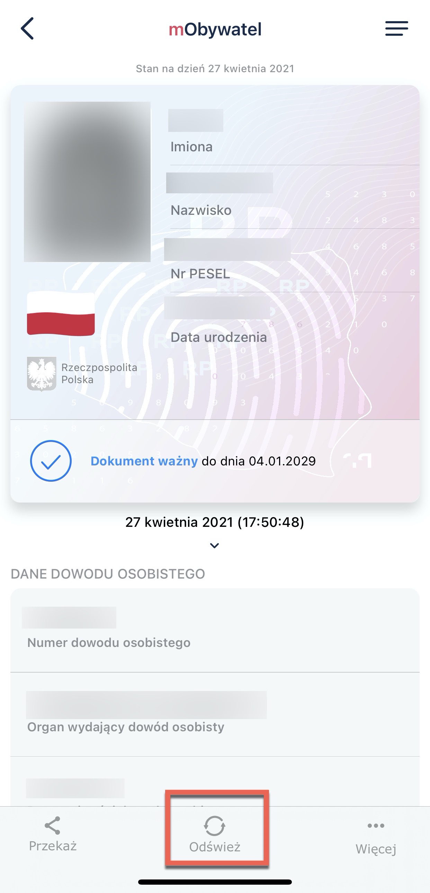
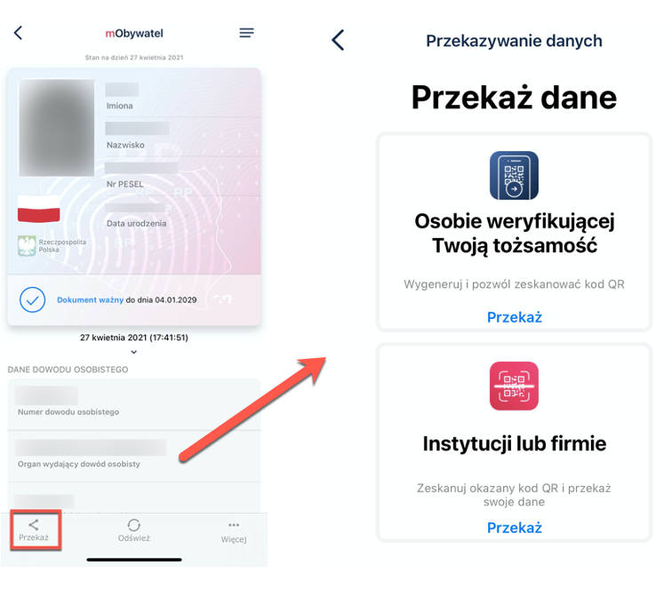
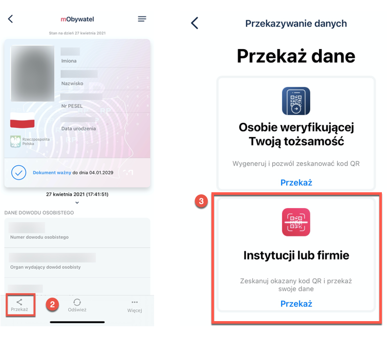
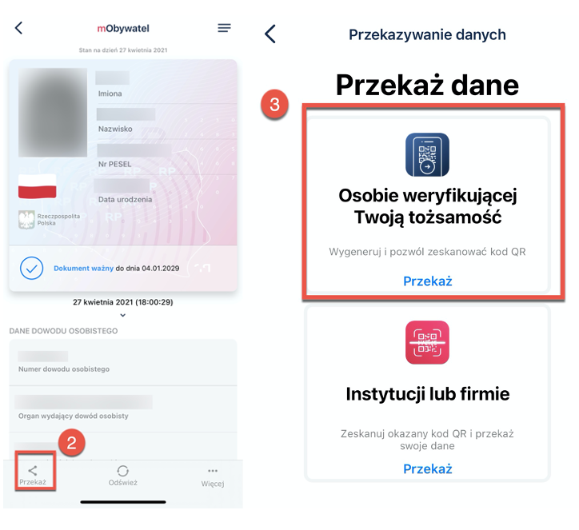
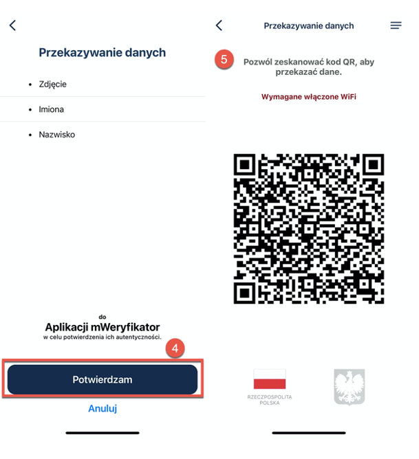
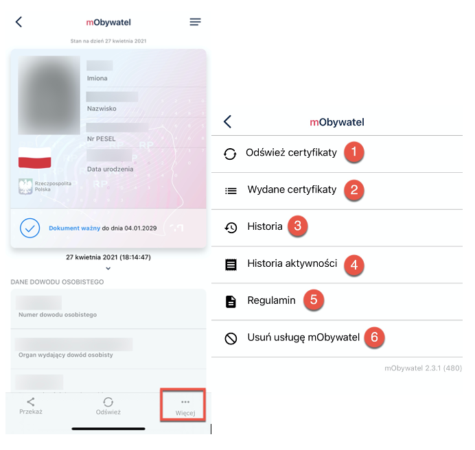

# mObywatel

After collecting the data from the ID Cards Register and the PESEL Register, a cryptographic certificate confirming the authenticity of the collected data is automatically created and downloaded.
The certificate is assigned to the user and the user's smartphone.
For certificate creation and management, the user's personal data and the name of the device for which the certificate was issued are processed. The validity of the certificate is limited to one year from the date of activation of the service. 

Functions available within the mObywatel:

The user can show their personal data to another person on the smartphone's screen they are using. The function is available by selecting the **mObywatel** icon on the home page.

You can use this document:

- in trains
- during inspections
- during elections
- when signing up for loyalty cards
- when collecting registered mail at a post office
- at the gym
- in a store
- at a reception desk
- in a clinic
- in a hotel

The scope of the data presented in this application includes:

1. Photo
2. First name
3. Surname
4. PESEL
5. Date of birth
6. ID card number
7. Issuing authority of the identity card
8. Expiration date of the identity card
9. Family name
10. Gender
11. Father's first name
12. Father's surname
13. Mother's name
14. Mother's surname 
15. Place of birth
16. Country of birth
17. Nationality
18. Address of permanent residence
19. Date of permanent residence

## Updating the data

 

The **refresh** icon enables downloading the data again and refreshing the certificates issued to the user on a given device. 

## Transferring data 

 

You can forward your online data to public or private entities (institutions) in order to benefit from the services they offer or to a person verifying identity. 

### Transfering the data to public or private entities

The data transfer takes place only to institutions verified in the mObywatel system.

To transfer your data to an institution:
1. Open the **mObywatel** service.
2. Select **transfer** at the bottom of the screen.
3. Select **transfer data to an institution or a company**.
   

   

4. Scan the QR code or copy it to the clipboard (QR code is available online or offline). Then, you see information about what data, to which institution, and for what purpose will be transferred. 

Operations performed during data transfer are cryptographically encrypted, which guarantees the security of the process. 

### Transfering data to a person verifying the identity

To provide data to a person verifying your identity as part of the mObywatel service, you need to:
1. Click **mObywatel** on the home page.
2. Select **transfer** at the bottom of the screen. 
3. Select **transfer to a person verifying your identity**.

    

 A window appears informing you what personal data you are handing over, to whom, and for what purpose.

4. Click **Confirm** to accept the transfer.
5. A QR code is displayed. Give it to the person verifying your identity.

    

Then, a message appears asking you to confirm the purpose of the data collection.
The app transfers the data to mWeryfikator - first and last name and low-resolution photo. The certificate status is also be displayed, which guarantees the security and validity of the data. The displayed data can be additionally verified online. 

### More options

By clicking **More** at the bottom of the screen, a menu with different options displays:

1. **Refresh certificates** - this function enables the automatic refresh of certificates.   
2. **Issued certificates** - view of certificates issued to the user along with the validity status.   
3. **History** - this function allows you to see the history of the verification of personal data with mWeryfikator, including the user ID and the date and time of data transfer. It stores the data referred to above for 1 year from the date of its recording.
4. **History of activity** - history of downloads and issued certificates.   
5. **Terms and conditions** - displays the regulations accepted by the user.   
6. **Delete the mObywatel service** - revokes the issued certificates and deletes the document.   