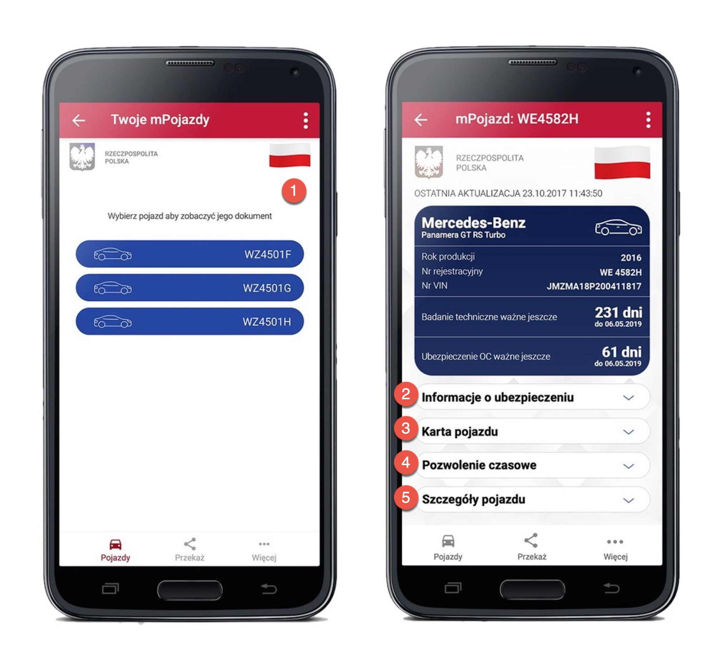
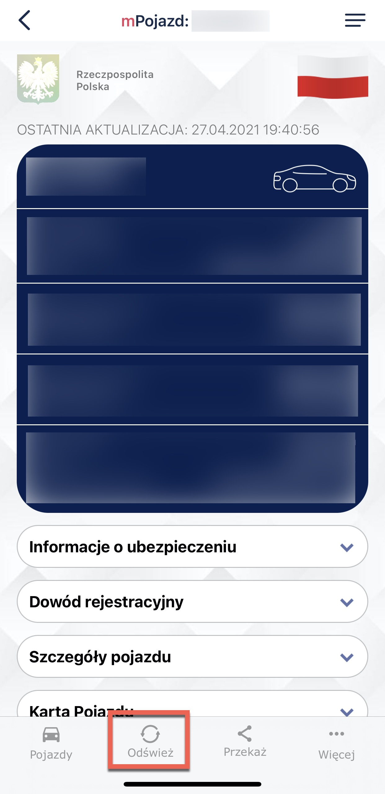
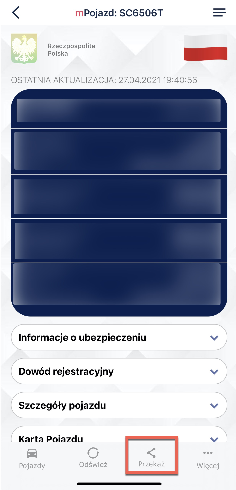
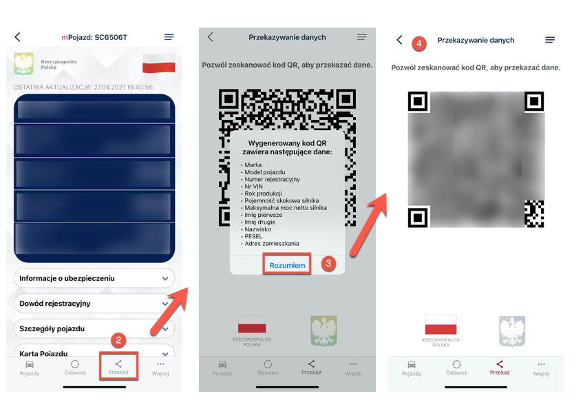
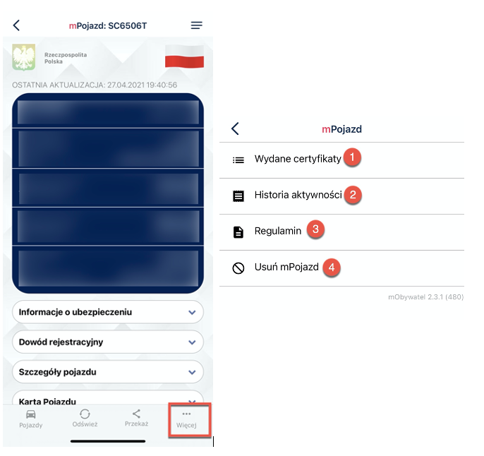

 
# mPojazd

The service may be used by persons who are owners or co-owners of vehicles (persons registered in the Central Register of Vehicles). The owner or co-owner of the vehicle can check the vehicle data. 

The mPojazd service also displays information about the expiration date of the third-party liability insurance and technical inspection of the vehicle and shows reminders 30 days before the end of their validity. 

The mPojazd home screen contains the following driver data:

1. On the **main screen**, basic information such as:
- vehicle make
- vehicle model
- type
- year of production
- registration number
- VIN number, and such.

2. In the **Insurance Information** section:
- insurer's name
- type of insurance
- policy series and number, and such.

3. In the **Vehicle History Card** section:
- document series and number
- document type 
- document issue date 

4. In the section **Temporary Permit** or **Vehicle Registration Card**:
- document series and number
- document type
- name of issuing authority, and such.

5. In the **Vehicle Details** section:
- origin of the vehicle
- total number of seats
- average fuel consumption, and such.

## Updating the data

The **refresh** icon enables downloading the data again and refreshing the certificates issued to the user on a given device. 

## Transferring data 

To provide the data to a person verifying your car documents:
1. Click **mPojazd** on the home page.
2. Select **transfer** at the bottom of the screen.

A window appears informing you what personal data you are handing over, to whom, and for what purpose.

3. Click **I understand** to accept the transfer.
4. A QR code is displayed. Give it to the person verifying the car documents.

### More options

By clicking **More** at the bottom of the screen, a menu with different options displays:

1. **Issued certificates** - view of certificates issued to the user along with the validity status.
2. **History of activity** - history of downloads and issued certificates.
3. **Terms and conditions** - displays the regulations accepted by the user.
6. **Delete the mPojazd service** - revokes the issued certificates and deletes the document. 