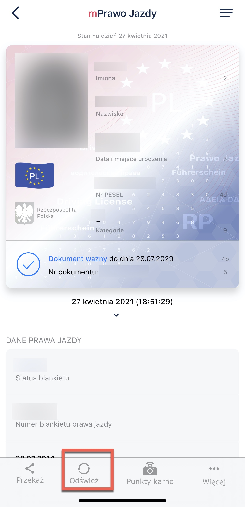
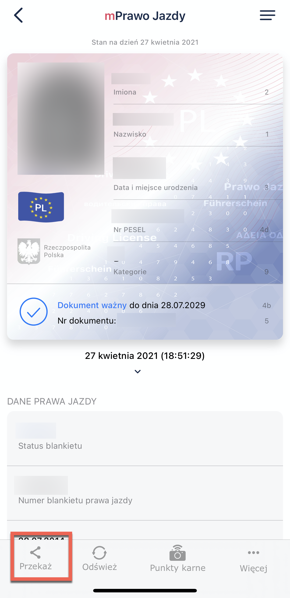
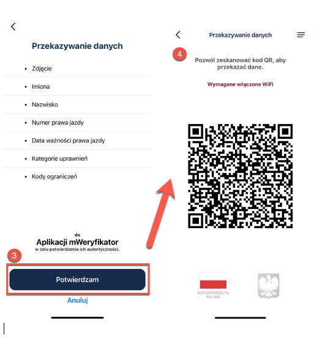
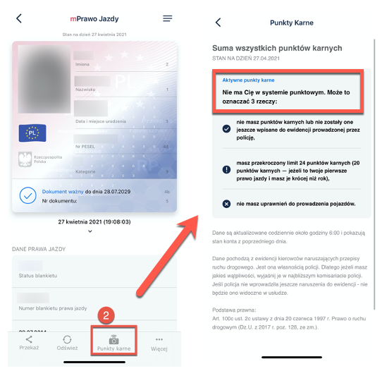
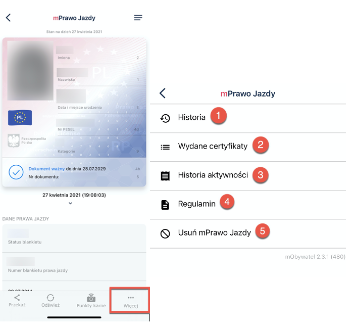

 
# mPrawo Jazdy

The mPrawo Jazdy home screen contains the following driver data:

 

1. First name
2. Surname
3. Date and place of birth
4. PESEL number
5. Photo
6. Categories of authorizations held
7. Information about the expiration date of the document or its invalidity,
8. Document number without the "/" sign (visible on the number of a traditional driving license number)
9. Status of the blank traditional driver's license
10. Number of blank traditional driving license
11. Date of issue of traditional driving license
12. Date of expiration 
13. Name of driving license issuing authority
14. The letter associated with the category (category name) placed on the infographic with the vehicle,
15. Date of attainment of the attestation in the given category (valid from)
16. The expiration date of the category (valid until)
17. Restrictions for the given category

## Updating the data

This function enables downloading user data again.
Downloading data requires the user to log in again with the electronic identification means (trusted profile, for example) issued in the electronic identification system.

## Transferring data 

To provide data to a person verifying your driving license, you need to:
1. Click **mPrawo Jazdy** on the home page.
2. Select **transfer** at the bottom of the screen.

A window appears informing you what personal data you are handing over, to whom, and for what purpose.

3. Click **Confirm** to accept the transfer.
4. A QR code is displayed. Give it to the person verifying your driving license.

### Penalty points

This function allows you to access your current balance of penalty points and the information about their awarding.

To check your penalty points:

1. Click **mPojazd** on the home page.
2. Select **penalty points** at the bottom of the screen.
   - If you have penalty points, the number of points, days to expire, and details of the traffic violation are displayed.
   - If you have no penalty points, the information that you are not in the system is displayed.

### More options

By clicking **More** at the bottom of the screen, a menu with different options displays:

1. **History** - this function allows you to see the history of the verification of personal data with mWeryfikator, including the user ID and the date and time of data transfer. It stores the data referred to above for 1 year from the date of its recording.
2. **Issued certificates** - view of certificates issued to the user along with the validity status.
3. **History of activity** - history of downloads and issued certificates.
4. **Terms and conditions** - displays the regulations accepted by the user.
6. **Delete the mPrawo Jazdy service** - revokes the issued certificates and deletes the document. 