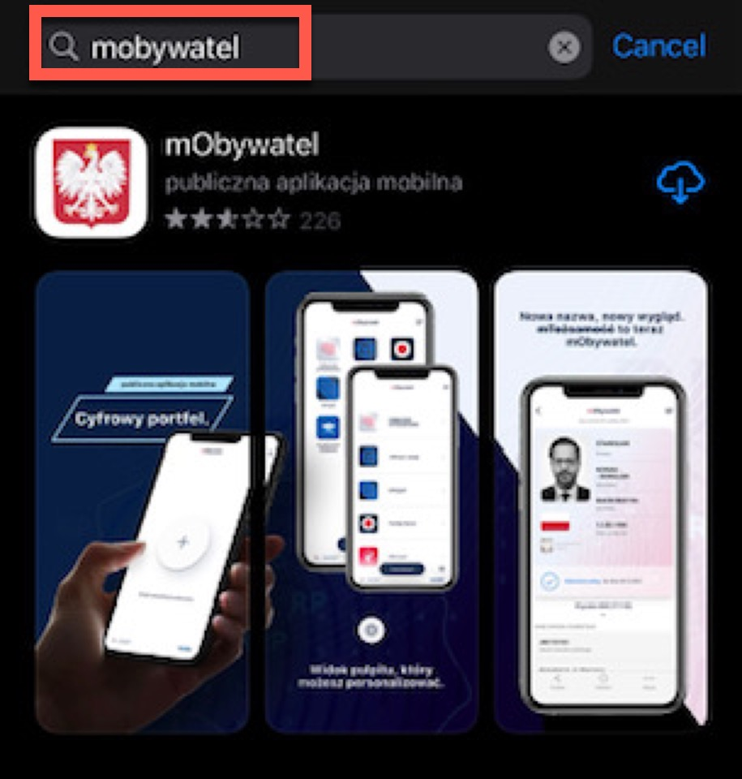
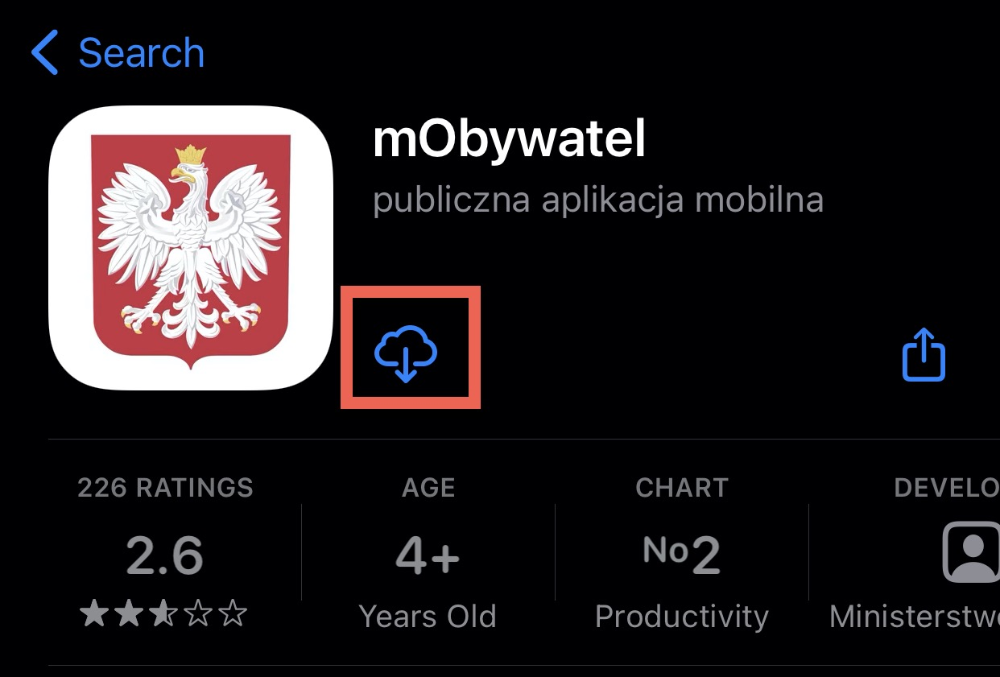
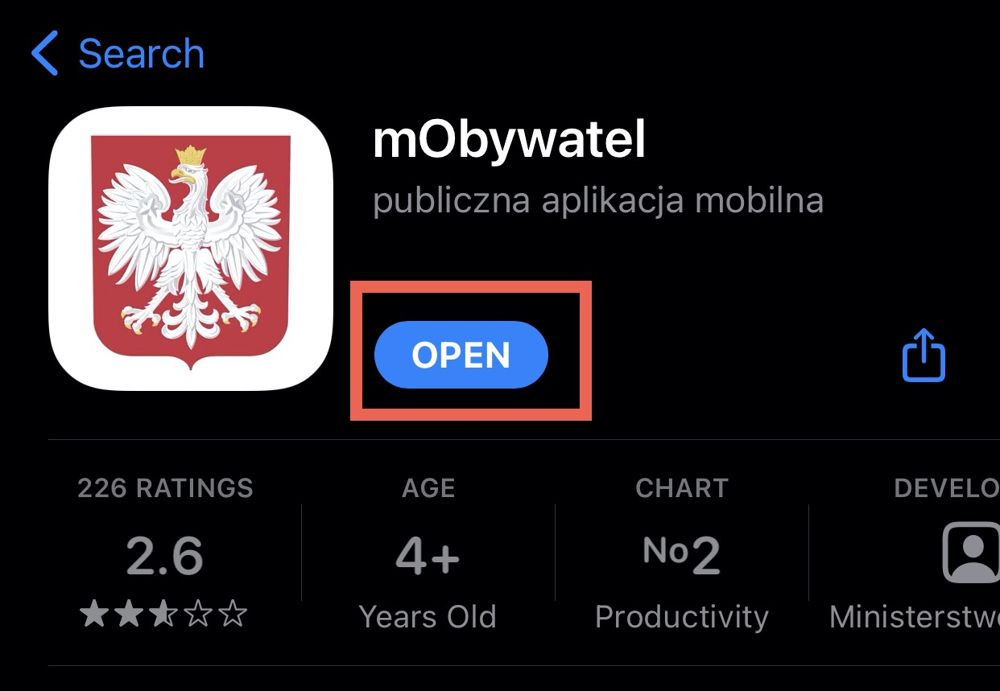

mObywatel installation  
=======  

Find out how to install mObywatel application.

You can download the application here:

# How to download mObywatel app?  

1. Go to **App store** or **Google Play** on your mobile.
2. In the search field, type **mObywatel**.  

3. Click **mObywatel** and click the **download** icon.  

4. Wait until the application downloads.
5. Click **Open**.  

The application has just been downloaded.