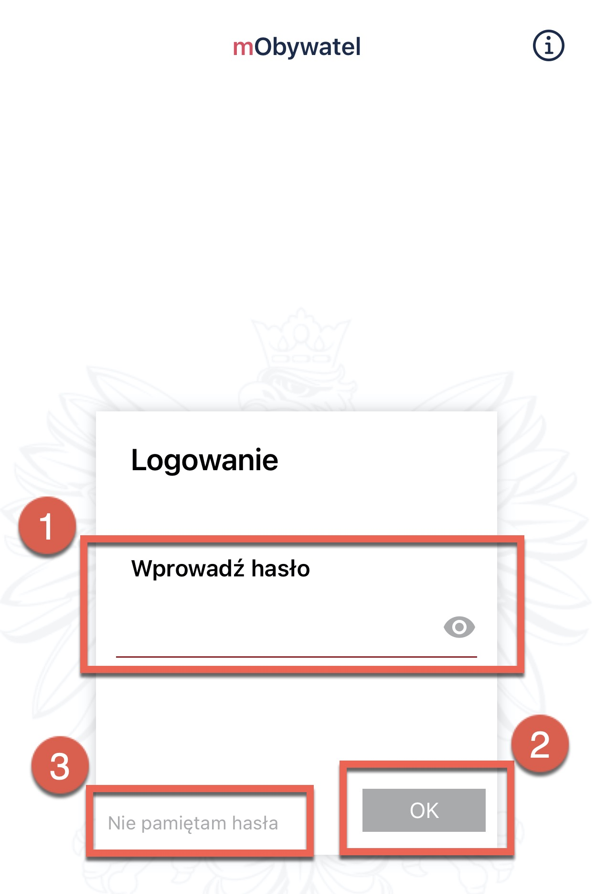

# Logging in

Once you have installed the application and have registered the account, find the application on your smartphone and open it.

Now, log in page displays.

Provide the password (1) and click **OK** (2).

If you have forgotten, the password, click **I forgot my password** (3).

Then, the pop-up window is displayed with a warning message:

The password to access the application is not stored outside of the user's smartphone. 

If you lose your password, you must:
1. Delete the application from the smartphone together with all data.
2. Reinstall and activate the application.

You are required to enter the password for the application each time after:
- a break in the use of the application of at least 5 (five) minutes,
- restarting the application after having switched it off,
- switching off the smartphone.

Entering an incorrect password three times causes a temporary block of access to the Application.   

# Secure login with biometrics and PIN

The application supports biometric login. This login method is additionally protected by PIN. To be able to use this feature, it is required to activate at least one document (e.g. ID).

To activate biometric authentication, the user has to:
- choose an appropriate option in the main menu of the application
- read the description of this functionality and accept terms and regulations,
- enter the current application password,
- set a PIN,
- put your finger on the fingerprint scanner on your smartphone, use the FaceID or Face Unlock function,
- log in to the application using the activated function.

