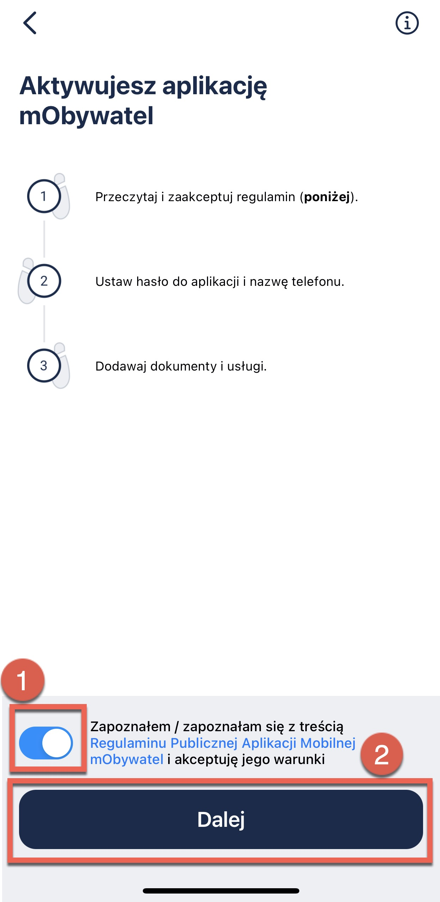
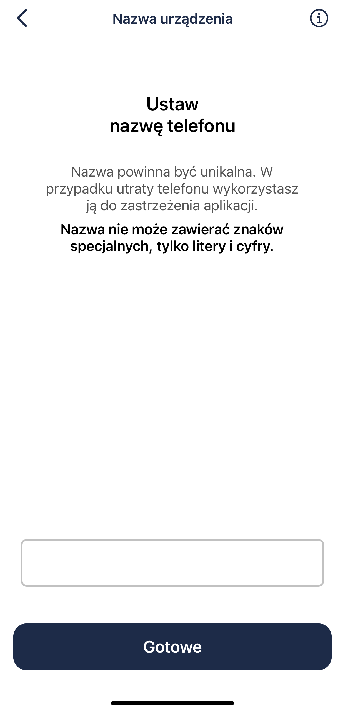

# Registration

Follow the steps to register to the mObywatel app.

Find and open the downloaded application on your smartphone.

This is the first view you see:

As you swipe right, you can see the following information:

1. **Digital wallet.**    
   
   mObywatel is a digital wallet for documents and e-government services.

2. **Many possibilities**   
   
   With mObywatel, you can show your personal information, use eRecepta, mPrawo Jazdy, mPojazd, and other functions.

3. **Data in the application**   
   
   Data are collected from state records. Downloading them requires confirming your identity with the trusted profile or your bank.

4. **For students**
   
   You can access the card by scanning the QR code that your school or university provides. A trusted profile is not necessary here.

Now, click **Start**.
   

## Activate your account

Then, you need to activate your account. First, read and accept **terms and conditions**.  

   

If you have read and accept the terms and conditions, click **I have read and accept the terms and conditions of the public mobile mObywatel application** (1) toggle and click **Next** (2).

## Set up a password

Password must contain:
- a minimum of 8 characters: [a-z]
- a minimum of 1 lower case letter: [a-z]
- a minimum of 1 uppercase letter: [A-Z]
- a minimum of 1 numeric character: [0-9]
- a minimum of 1 special character: !@#$%^&*

**Please note:** If you lose your password, all data stored in the application will be lost. Password recovery is not possible. For further information, refer to [**Logging**](logging.md) section.

Click **Next**.

## Set up phone name

The phone name must be unique. In case the phone is lost, it is used to cancel the application. The name cannot contain special characters, only letters and numbers.

Click **Next**.

After registration, you have access to the application. This is how it should look like:

